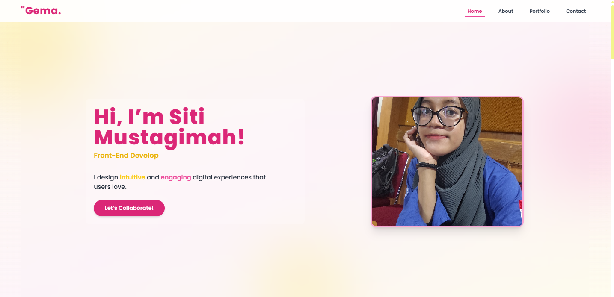

# ✨ Personal Website Portfolio Project ✨
<!-- 
<p align="center">
  
</p>

<p align="center">
  Oleh: <strong>Nugra21 (Ludang Prasetyo Nugroho)</strong>
</p> -->

---

## 🚀 Sekilas Proyek

Proyek ini adalah pengembangan website portofolio pribadi, dirancang untuk menampilkan proyek-proyek, keahlian, dan perjalanan profesional seseorang secara digital.

Website portofolio ini dibangun dengan fokus pada estetika modern, pengalaman pengguna yang intuitif, dan performa yang optimal. Situs ini merepresentasikan eksplorasi saya dalam pengembangan *frontend* modern menggunakan *library* dan *framework* terkini.

---

## 🔗 Live Demo & Pratinjau

Saksikan website portofolio ini beraksi secara langsung:

🌐 **Kunjungi Website Langsung:** [**https://gemaa.pages.dev**](https://gemaa.pages.dev)
*(Catatan: URL ini adalah contoh demo proyek, bukan berarti terkait dengan individu tertentu.)*

---

## ✨ Fitur Unggulan

Website portofolio ini menawarkan beragam fitur yang menonjol untuk presentasi yang efektif:

* **Desain Modern & Responsif:** Antarmuka pengguna (UI/UX) yang bersih dan intuitif, secara otomatis beradaptasi dengan berbagai ukuran layar perangkat (desktop, tablet, *mobile*).
* **Performa Cepat:** Dibangun menggunakan **React.js** untuk arsitektur UI yang efisien dan dioptimalkan dengan **Vite** sebagai *build tool* untuk pengembangan yang sangat cepat dan *bundling* yang efisien.
* **Styling Fleksibel & Efisien:** Menggunakan **Tailwind CSS**, sebuah *utility-first CSS framework*, yang memungkinkan kustomisasi gaya yang cepat dan menjaga ukuran *stylesheet* tetap minimal dan mudah dikelola.
* **Animasi Interaktif:** Meningkatkan daya tarik visual dan pengalaman pengguna dengan animasi halus dan dinamis berkat integrasi **Framer Motion**.
* **Struktur Modular:** Kode yang terorganisir dengan baik menjadi komponen-komponen yang *reusable* (dapat digunakan kembali), memudahkan pemeliharaan dan pengembangan di masa mendatang.
* **Navigasi Komprehensif:** Termasuk bagian-bagian penting untuk presentasi portofolio yang lengkap dan informatif:
    * Beranda (Home)
    * Tentang (About)
    * Portofolio (Proyek, Sertifikat, Tech Stack)
    * Kontak (Contact)

---

## 💻 Teknologi di Balik Layar

Proyek ini dibangun di atas tumpukan teknologi modern berikut:

<p align="center">
  
</p>

* **Frontend Library:** ⚛️ **React.js**
* **Build Tool:** ⚡ **Vite**
* **CSS Framework:** 🎨 **Tailwind CSS**
* **Animasi:** 🎞️ **Framer Motion**
* **Hosting & CDN:** ☁️ **Cloudflare Pages** (untuk deployment gratis, cepat, dan global)
* **Lingkungan Pengembangan:** 🛠️ **Node.js**

---

## 🛠️ Panduan Instalasi & Penggunaan (Lokal)

Ingin mencoba dan menjalankan website portofolio ini di mesin lokal Anda? Ikuti langkah-langkah mudah berikut:

### Prasyarat

Sebelum memulai, pastikan Anda telah menginstal:

* [**Node.js**](https://nodejs.org/en/) (disarankan v16+ atau versi yang kompatibel)
* [**Git**](https://git-scm.com/)

### Langkah-langkah Instalasi

1.  **Clone Repositori:**
    Buka terminal atau *command prompt* Anda, lalu klon repositori proyek ini:
    ```bash
    git clone [https://github.com/username/nama-repo-proyek-portofolio.git](https://github.com/username/nama-repo-proyek-portofolio.git)
    cd nama-repo-proyek-portofolio
    ```
    *(**Penting:** Ganti `username/nama-repo-proyek-portofolio.git` dengan URL repositori GitHub aktual untuk proyek website ini.)*

2.  **Instal Dependensi:**
    Navigasikan ke direktori proyek, lalu instal semua dependensi yang diperlukan:
    ```bash
    npm install
    ```

3.  **Jalankan Mode Development:**
    Untuk memulai aplikasi dalam mode pengembangan, jalankan perintah ini. Aplikasi akan otomatis terbuka di browser Anda pada alamat default.
    ```bash
    npm run dev
    ```

    Website akan berjalan secara default di: [http://localhost:5173](http://localhost:5173)

---

## ☁️ Proses Deployment

Website portofolio ini di-deploy secara otomatis menggunakan **Cloudflare Pages**. Cloudflare Pages menyediakan infrastruktur *hosting* yang cepat, gratis, dan mendukung CI/CD (Continuous Integration/Continuous Deployment) langsung dari repositori Git.

### Alur Deployment (CI/CD)

Setiap kali ada *push* perubahan ke *branch* utama (biasanya `main` atau `master`) di repositori GitHub ini, Cloudflare Pages akan secara otomatis:

1.  Mendeteksi perubahan kode.
2.  Membangun ulang proyek dari awal.
3.  Mempublikasikan versi terbaru website ke URL live yang sama.

Ini memungkinkan siklus pengembangan yang cepat dan efisien, memastikan portofolio selalu *up-to-date*!

---

## 🤝 Kontribusi

Saran atau kontribusi untuk meningkatkan website portofolio ini sangat kami hargai! Jika Anda memiliki ide untuk fitur baru, perbaikan *bug*, atau peningkatan, jangan ragu untuk berpartisipasi.

1.  *Fork* repositori ini.
2.  Buat *branch* baru untuk fitur/perbaikan Anda (`git checkout -b feature/nama-fitur`).
3.  Lakukan perubahan dan *commit* dengan pesan yang jelas (`git commit -m 'feat: Menambahkan [Fitur Baru]'`).
4.  *Push* *branch* Anda (`git push origin feature/nama-fitur`).
5.  Ajukan *Pull Request*.

---

## 📄 Lisensi

Proyek ini dilisensikan di bawah **MIT License**.
Lihat file [LICENSE](LICENSE) untuk detail informasi lisensi.

---

## 👨‍💻 Tentang Pengembang

Proyek website portofolio ini dikembangkan oleh **Nugra21 (Ludang Prasetyo Nugroho)**.

Anda dapat terhubung dengan saya melalui:

* 🌐 **Website Pribadi:** [nugra.my.id](https://nugra.my.id)
* 📧 **Email:** [nugra315@gmail.com](mailto:nugra315@gmail.com)
* ▶️ **YouTube Channel:** [Kunjungi Channel YouTube Saya](https://www.youtube.com/@nugra21)
* **LinkedIn:** *(Tambahkan link LinkedIn Anda jika sudah tersedia)*

---

<p align="center">
  
</p>


<!-- # ✨ Gema's Personal Website Portfolio ✨

<p align="center">
  
</p>

<p align="center">
  Oleh: <strong>Nugra21 (Ludang Prasetyo Nugroho)</strong>
</p>

---

## 🚀 Sekilas Proyek

Proyek ini adalah website portofolio pribadi untuk **Gema**, dirancang untuk menampilkan proyek-proyek, keahlian, dan perjalanan profesionalnya secara digital.

**Gema's Personal Website** dibangun dengan fokus pada estetika modern, pengalaman pengguna yang intuitif, dan performa yang optimal. Situs ini merepresentasikan eksplorasi saya dalam pengembangan *frontend* modern menggunakan *library* dan *framework* terkini.

---

## 🔗 Live Demo & Pratinjau

Saksikan website portofolio Gema beraksi secara langsung:

🌐 **Kunjungi Website Langsung:** [**https://gemaa.pages.dev**](https://gemaa.pages.dev)

---

## ✨ Fitur Unggulan

Website portofolio ini menawarkan beragam fitur yang menonjol untuk presentasi yang efektif:

* **Desain Modern & Responsif:** Antarmuka pengguna (UI/UX) yang bersih dan intuitif, secara otomatis beradaptasi dengan berbagai ukuran layar perangkat (desktop, tablet, *mobile*).
* **Performa Cepat:** Dibangun menggunakan **React.js** untuk arsitektur UI yang efisien dan dioptimalkan dengan **Vite** sebagai *build tool* untuk pengembangan yang sangat cepat dan *bundling* yang efisien.
* **Styling Fleksibel & Efisien:** Menggunakan **Tailwind CSS**, sebuah *utility-first CSS framework*, yang memungkinkan kustomisasi gaya yang cepat dan menjaga ukuran *stylesheet* tetap minimal dan mudah dikelola.
* **Animasi Interaktif:** Meningkatkan daya tarik visual dan pengalaman pengguna dengan animasi halus dan dinamis berkat integrasi **Framer Motion**.
* **Struktur Modular:** Kode yang terorganisir dengan baik menjadi komponen-komponen yang *reusable* (dapat digunakan kembali), memudahkan pemeliharaan dan pengembangan di masa mendatang.
* **Navigasi Komprehensif:** Termasuk bagian-bagian penting untuk presentasi portofolio yang lengkap dan informatif:
    * Beranda (Home)
    * Tentang (About)
    * Portofolio (Proyek, Sertifikat, Tech Stack)
    * Kontak (Contact)

---

## 💻 Teknologi di Balik Layar

Proyek ini dibangun di atas tumpukan teknologi modern berikut:

<p align="center">
  
</p>

* **Frontend Library:** ⚛️ **React.js**
* **Build Tool:** ⚡ **Vite**
* **CSS Framework:** 🎨 **Tailwind CSS**
* **Animasi:** 🎞️ **Framer Motion**
* **Hosting & CDN:** ☁️ **Cloudflare Pages** (untuk deployment gratis, cepat, dan global)
* **Lingkungan Pengembangan:** 🛠️ **Node.js**

---

## 🛠️ Panduan Instalasi & Penggunaan (Lokal)

Ingin mencoba dan menjalankan website Gema di mesin lokal Anda? Ikuti langkah-langkah mudah berikut:

### Prasyarat

Sebelum memulai, pastikan Anda telah menginstal:

* [**Node.js**](https://nodejs.org/en/) (disarankan v16+ atau versi yang kompatibel)
* [**Git**](https://git-scm.com/)

### Langkah-langkah Instalasi

1.  **Clone Repositori:**
    Buka terminal atau *command prompt* Anda, lalu klon repositori proyek ini:
    ```bash
    git clone [https://github.com/username/nama-repo-gema.git](https://github.com/username/nama-repo-gema.git)
    cd nama-repo-gema
    ```
    *(**Penting:** Ganti `username/nama-repo-gema.git` dengan URL repositori GitHub aktual untuk proyek website Gema.)*

2.  **Instal Dependensi:**
    Navigasikan ke direktori proyek, lalu instal semua dependensi yang diperlukan:
    ```bash
    npm install
    ```

3.  **Jalankan Mode Development:**
    Untuk memulai aplikasi dalam mode pengembangan, jalankan perintah ini. Aplikasi akan otomatis terbuka di browser Anda pada alamat default.
    ```bash
    npm run dev
    ```

    Website akan berjalan secara default di: [http://localhost:5173](http://localhost:5173)

---

## ☁️ Proses Deployment

Website portofolio Gema di-deploy secara otomatis menggunakan **Cloudflare Pages**. Cloudflare Pages menyediakan infrastruktur *hosting* yang cepat, gratis, dan mendukung CI/CD (Continuous Integration/Continuous Deployment) langsung dari repositori Git.

### Alur Deployment (CI/CD)

Setiap kali ada *push* perubahan ke *branch* utama (biasanya `main` atau `master`) di repositori GitHub ini, Cloudflare Pages akan secara otomatis:

1.  Mendeteksi perubahan kode.
2.  Membangun ulang proyek dari awal.
3.  Mempublikasikan versi terbaru website ke URL live yang sama.

Ini memungkinkan siklus pengembangan yang cepat dan efisien, memastikan portofolio Gema selalu *up-to-date*!

---

## 🤝 Kontribusi

Saran atau kontribusi untuk meningkatkan website portofolio ini sangat kami hargai! Jika Anda memiliki ide untuk fitur baru, perbaikan *bug*, atau peningkatan, jangan ragu untuk berpartisipasi.

1.  *Fork* repositori ini.
2.  Buat *branch* baru untuk fitur/perbaikan Anda (`git checkout -b feature/nama-fitur`).
3.  Lakukan perubahan dan *commit* dengan pesan yang jelas (`git commit -m 'feat: Menambahkan [Fitur Baru]'`).
4.  *Push* *branch* Anda (`git push origin feature/nama-fitur`).
5.  Ajukan *Pull Request*.

---

## 📄 Lisensi

Proyek ini dilisensikan di bawah **MIT License**.
Lihat file [LICENSE](LICENSE) untuk detail informasi lisensi.

---

## 👨‍💻 Tentang Pengembang

Proyek website portofolio Gema ini dikembangkan oleh **Nugra21 (Ludang Prasetyo Nugroho)**.

Anda dapat terhubung dengan saya melalui:

* 🌐 **Website Pribadi:** [nugra.my.id](https://nugra.my.id)
* 📧 **Email:** [nugra315@gmail.com](mailto:nugra315@gmail.com)
* ▶️ **YouTube Channel:** [Kunjungi Channel YouTube Saya](https://www.youtube.com/@nugra21)
* **LinkedIn:** *(Tambahkan link LinkedIn Anda jika sudah tersedia)*

---

<p align="center">
  
</p> -->